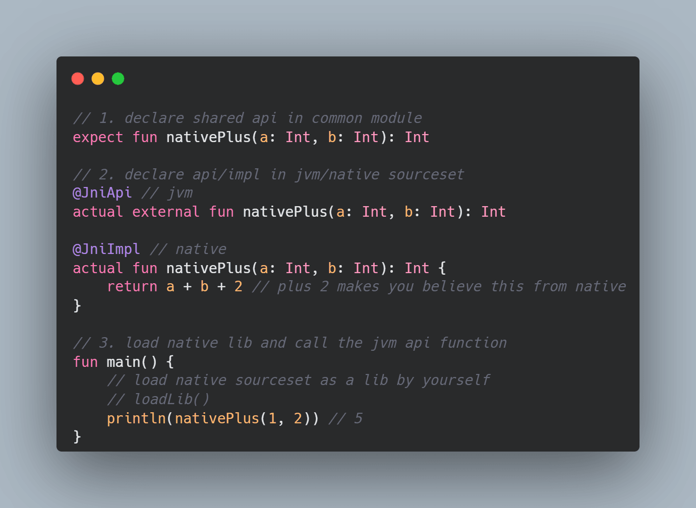

# KN-JVM



Auto JNI binding based on Kotlin Multiplatform. Just need simply declare functions in the common module, and the tool
will automatically generate the corresponding Kotlin Native code (based on KSP)

## Usage

```kotlin
// 1. declare shared api in common module
@JniShared
expect fun nativePlus(a: Int, b: Int): Int

// 2. declare api/impl in jvm/native sourceset
@JniApi // jvm
actual external fun nativePlus(a: Int, b: Int): Int

@JniImpl // native
actual fun nativePlus(a: Int, b: Int): Int {
    return a + b + 2 // plus 2 makes you believe this from native
}

// 3. load native lib and call the jvm api function
fun main() {
    // load native sourceset as a lib by yourself
    // loadLib()
    println(nativePlus(1, 2)) // 5
}
```

### Custom Type

You need to use [kotlinx.serialization](https://github.com/Kotlin/kotlinx.serialization) for custom type support.
We will use [ProtoBuf](https://github.com/Kotlin/kotlinx.serialization/blob/master/formats/README.md#ProtoBuf) as data
transfer format when you want to pass an object as parameter between Kotlin/JVM and Kotlin/Native. Sample below:

```kotlin
@JniShared
expect fun nativePlus(a: Int, b: Foo): Bar

@Serializable // make sure your object is Serializable
class Foo(val v: String)

@Serializable // return type also need Serializable
class Bar(val v: String)

```

When using it, it is completely same with normal usage, and no additional adaptation is required:

```kotlin
fun main() {
    println(nativePlus(1, Foo("f")).v)
}
```

### Performance

I made some simple [performance testing](demo-benchmark/src/main/java/org/example/PerformanceTest.kt) based on my local machine:

> Environment: single thread, Windows 11, 32G RAM, AMD Ryzen 9 7940HS, 4700 MHz (47 x 100)  
> 
> `ms/mop`: milliseconds per million calls  
> `op/s`: operations per seconds

|             | direct-call                       | simple-task                                                                                                         |
|-------------|-----------------------------------|---------------------------------------------------------------------------------------------------------------------|
| operations  | 52.83 ms/mop (18,927,709.84 op/s) | 9607.47 ms/mop (104,085.72 op/s)                                                                                    |
| description | kotlin function direct call       | a very simply implementation, contains 1 basic type and 2 custom types. <br/> Can be used to test interaction costs |

According to the data of `direct-call` and `simple-task`, we can get the extra cost of frequent JNI calls, and
serialization, and other operations is about 9.55 ms per thousand calls, which means that on average such a call may
consume an extra `10 μs`.

But usually we only transfer time-consuming operations to native, or call some native libs, 
in these cases, `10 μs` may be acceptable.

### Gradle Setup

[Maven Central: kni-api](https://central.sonatype.com/artifact/io.github.zsqw123/kni-api)


1. apply [KSP](https://github.com/google/ksp) to your project:
    ```kotlin
    plugins {
        kotlin("multiplatform")
        kotlin("plugin.serialization") // for custom type supports
        id("com.google.devtools.ksp")
    }
    ```
2. apply `kni` ksp plugin to different target
    ```kotlin
    commonMain {
        dependencies {
            implementation("io.github.zsqw123.kni:api:<version>")
        }
    }
    
    dependencies {
        val kniKspPath = "io.github.zsqw123.kni:ksp:<version>"
        // your jvm platform target, here is a sample
        add("kspJvm", kniKspPath)
        // your native platform target, here is windows x64 sample
        add("kspMingwX64", kniKspPath)
    }
    ```
3. add configurations:
    ```kotlin
    ksp {
        // config jni package, For Android platform, usually `platform.android`
        arg("kni-jni-package", "zsu.jni")
    }
    ```

   | arg                           | required | defaultValue      | description                         |
   |-------------------------------|:--------:|-------------------|-------------------------------------|
   | kni-jni-package               |   yes    |                   |                                     |
   | kni-generated-package         |    no    | zsu.kni.generated | package name of generated code      |
   | kni-generated-proto-name      |    no    | JniNativeProto    | class name of generated proto class |
   | kni-generated-serializer-name |    no    | Serializer        | class name of generated serializer  |

> or take a look at demo project here: [demo-kni](demo-kni)

#### How to run Kotlin/Native codes from jvm?

You need to load native libraries which produced by Kotlin/Native sourceSets manually, and it is not autoload by this
plugin, but still can check the sample here: [demo-kni](demo-kni)

## Other

### (WIP) Tech Solution

We use the Lark to write the technical solution, although it is currently only available in Chinese, but you
can choose to use Lark document translator

[From KMM to Project Panama, or Higher](https://eqyrx3fg3l.feishu.cn/docx/K4WQdNDYso6sGTxPmM5c9KVCnYK)

### License

```
Copyright 2023 zsqw123

Licensed under the Apache License, Version 2.0 (the "License");
you may not use this file except in compliance with the License.
You may obtain a copy of the License at

    http://www.apache.org/licenses/LICENSE-2.0

Unless required by applicable law or agreed to in writing, software
distributed under the License is distributed on an "AS IS" BASIS,
WITHOUT WARRANTIES OR CONDITIONS OF ANY KIND, either express or implied.
See the License for the specific language governing permissions and
limitations under the License.
```
